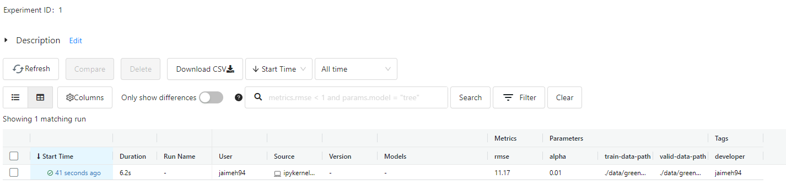

**Experiment tracking**
---


# Intro

## Important concepts
* ML experiement

## Whats's experiment tracking

Is the porcess of keeping track of all the **relevant information** from an ML experiment, which includes:

* Surce code
* Enviroment
* Data
* Mode
* Hyperparameters
* Metrics

## Why is experiment tracking so important?

Three main reasons:
* Reproducibility
* Organization
* Optimization

## Why is not enough tracking experiments in spreadsheets?
* Error prone: fill manually the metrics
* No standard format
* Visibility and collaboration


---
## **MLflow**

Is a tool specially created to tracking

Definition: *'An open source platform for the machine learnig lifecycle'*

In practice, it's just a Python package that can be installed with pip, and it contains 4 main modules:
* Tracking
* Models
* Model registry
* Projects

### Tracking experiments with MLflow
The module Tracking of MLflow allows us to organize our experiments into runs, and keep track of:

* Parameters: hyperparameters, path of the dataset, preprosessing
* Metrics: any evaluation metric, accuracy, f1, etc.
* Metadata: example: tags
* Artifacts: example: a visualization
* Models:

Along with this information, MLflow automatically logs extrainformation about the run:
* Source code
* Version of the code (git commit)
* Start and end time
* Author

### Demo

These are the usage commands:


# Getting stared with MLflow

## Install package
We need to install the package, the video show the next:

* mlflow
* jupyter
* scikit-learn
* pandas 
* seaborn
* hyperopt
* xgboost

I use conda enviroment, I had to use conda-forge to install mlflow and hyperopt.

## Interface

We can open the user interface with the command `mlflow ui`, but this way we can't go to the model module. To fix this, we user the command: `mlflow ui --backen
d-store-uri sqlite:///mlflow.db`

So, we'll see this:


## Adding MLflow to a existing notebook

Now, we going to use the notebook trained in the session one [duration-prediction.ipynb](duration-prediction.ipynb), and we'll add tracking lines.

* Firstable we need to import the mlflow library
* Set the tracking uri that we defined when we ran mlflow ui (`sqlite:///mlflow.db`)
* Set the experiment, in this example the name is `nyc-taxi-experiment`

This way:

```
import mlflow

mlflow.set_tracking_uri('sqlite:///mlflow.db')
mlflow.set_experiment('nyc-taxi-experiment')
```

To record the performance of the model, we need to star a new run
, next we can add tags like the developer, and next we can add params like which data is used and the params of the model, also we log the metric of the model: 

```
with mlflow.start_run():

    mlflow.set_tag('developer','jaimeh94')

    mlflow.log_param('train-data-path','./data/green_tripdata_2021-01.parquet')
    mlflow.log_param('valid-data-path','./data/green_tripdata_2021-02.parquet')
    
    alpha = 0.01
    mlflow.log_param('alpha',alpha)
    lr = Lasso(alpha)
    lr.fit(X_train, y_train)

    y_pred = lr.predict(X_val)

    rmse = mean_squared_error(y_val, y_pred, squared=False)

    mlflow.log_metric('rmse',rmse)
```

We can see the first run in the mlflow ui:



# Experiment tracking with MLflow

