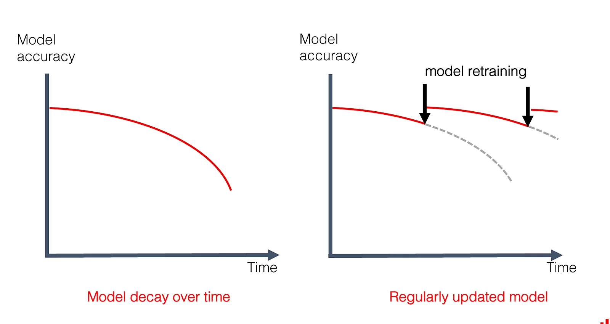

# Module 3. Workflow orchestration with Prefect

Contents
=================
- [Introduction](#introduction)
- [Prefect framework](#prefect)
- [Prefect flow basics](#prefect-basics)
- [Remote Prefect Orion Deployment on AWS](#prefect-on-aws)
- [Deployment of Prefect Orion Flow](#prefect-deployment)
- [Work queues and agents corresponding to different environments](#prefect-different-envs)

<a name="introduction"></a>
## 1. Introduction

[Video](https://youtu.be/eKzCjNXoCTc)

**Workflow orchestration** is a set of tools that schedule and monitor the work you want to accomplish. If you have a computational pipeline that you want to run, the orchestration tool can schedule it and tell you where and when the pipeline fails.

In this chapter, we will work with the orchestration tool called [Prefect](https://www.prefect.io/).


### Pipeline example

The image below shows an example of a computational pipeline. Let's say we have a PostgreSQL database from which we extract data into Parquet files. We then use Pandas to ingest those Parquet files, combined with some of the API data we fetch. Then we pass it to Scikit-Learn to train the model, and then we register artifacts and experiments in MLFlow. Finally, we deploy the model using Flask.


Some steps can be grouped together into computational blocks highlighted with blue boxes. These blocks are interconnected. For example, what do we do if the database is under maintenance and it can not output the parquet files? This will affect the downstream tasks.

The goal of workflow orchestration is to minimize the impact of errors and fail "gracefully" when it happens. 

### Negative engineering

[Video](https://youtu.be/Yb6NJwI7bXw)

**Negative engineering** protects the outcomes of your code by defending them from possible failures. In other words, it is coding against failure. It takes about 90% of all engineering time in a project.

Workflow orchestration includes a set of features aimed at eliminating negative engineering. Some of these features are

- Notifications
- Observability into Failure 
- Conditional Failure Logic
- Timeouts

Nice [article](https://future.com/negative-engineering-and-the-art-of-failing-successfully/#:~:text=Negative%20engineering%20is%20the%20time,success%20of%20their%20primary%20objectives.) about negative engineering.

### Why do we need to retrain a model in production? 

The model accuracy usually decreases over time (see the diagram below, [source](https://evidentlyai.com/blog/machine-learning-monitoring-data-and-concept-drift)). This phenomenon is called drift. To avoid this, it is necessary to regularly retrain models. After retraining, you can push your new model to production keeping the performance high. 



Since it requires running machine learning pipeline multiple times, it makes sence to automate it with workflow orchestrating tool:

<a name="prefect"></a>
## 2. Prefect framework

[Video](https://youtu.be/Yb6NJwI7bXw)

### Prefect Versions

Prefect is an Open-Source Workflow Orchestration Framework. There are two version: **Prefect Core** (or Prefect 1) and **Prefect Orion** (or Prefect 2).

**Prefect One** requires the user to define a **static graph (DAG)**, which means that you must specify in advance all the possible steps your workflow can take. Then at runtime, with help of triggers, you already know which part should not be executed in case of certain failures.

**Prefect Two**, on the other hand, is more **dynamic** and minimally invasive in Python code. The latter means that you have to make minimal changes to your code in order to build the workflow on top of it.

Moreover, in Prefect One, every function in a Flow must be wrapped as a task, while in Prefect Two there is much more flexibility.

### Prefect in a code

The image below shows a simple code getting the number of stars for a GitHub repository:


The bottom line of code starts a flow consisting of a single task called multiple times from a loop. Tasks and flows are defined with appropriate decorators that include some execution parameters in their definition (number of tries *etc*). These decorators are the only Prefect dependencies here.

<a name="prefect-basics"></a>
## 3. Prefect flow basics

### Installing Prefect

By default, pip installs Prefect One. To install Prefect Two, you need to explicitly specify the version:
```
pip install prefect==2.0b5
```

### Adding flows and tasks

Let's add a flow decorator to the main function of [our script](https://github.com/DataTalksClub/mlops-zoomcamp/blob/main/03-orchestration/prefect_flow.py):

```
from prefect import flow

@flow
def main():
    ....
``` 

Also we add a task decorator to one of the functions called in the flow above:

```
from prefect import task

@task
def add_features(df_train, df_val):
    ...

X_train, X_val, y_train, y_val, dv = add_features(X_train, X_val).result()
```

In addition, we have to add `.result()` to the function call (explanation is not clear).

When running the script with the flow decorator, you can see that we get more logs. Moreover, the worflow run now has a name to distinguish it from other runs. 

### Prefect's GUI

[Video](https://youtu.be/MCFpURG506w)

**GUI**. Let's start a GUI locally:

```
prefect orion start
```

Open dashboard at http://127.0.0.1:4200 (if you run it locally).


**Task runner**. `ConcurrentTaskRunner` is executed by default if all tasks in a flow are independent of each other. In this case, they can be run asynchronously and independently. Instead, we will make it sequential:

```
from prefect.task_runners import SequentialTaskRunner

@flow(task_runner=SequentialTaskRunner())
def main():
    ...
```

If we keep the default type and rerun the experiment, we will run into an error saying that the job has already been executed. 

**Task dependencies**. Now let's check out a radar chart showing us the dependencies between different tasks using a concentric plot:


As you pass data between tasks, you find more concentric circles with data dependencies between them. For example, in the figure above, we can see that the `add_features` task depends on two different `read_dataframes` as data is passed to it.

**Caching**. Already completed tasks are cached so that they do not run again. If you try to rerun it, the results will be fetched from the cache.

<a name="prefect-on-aws"></a>
## 4. Remote Prefect Orion Deployment on AWS

[Video](https://youtu.be/ComkSIAB0k4)

**Modifying network protocols**: By default, an AWS EC2 instance only allows TCP connection protocol with ssh on port 22. Thus, we need to change the security protocol for the running instance if we want to be able to connect to the Perfect running inside.

1. Go to the security group
2. Click on "Edit inbound rules"
3. Add HTTP and (probably) HTTPS from everywhere (0.0.0.0/0)
4. Add Custom TCP and CUstom UDP for port 4200 from everywhere (0.0.0.0/0)
5. Save rules 

Now you should see the changes in the security tab of your EC2 instance. 

**Configure Prefect on AWS**. Connect to the instance with ssh and install Prefect into the conda environment: `pip install prefect==2.0b5`. Set the Prefect environment variable

```
prefect config set PREFECT_ORION_UI_API_URL="http://<external-ip>:4200/api"
```
where `<external_ip>` is the IP address of your instance.

You can verify that the configuration was successfully registered by running
```
prefect config view
```

If you still see an old configuration, clean it up by running
```
prefect config unset PREFECT_ORION_UI_API_URL
```
and then rerun the set procedure as shown above.

**Launch Prefect server on AWS**. Now we can start the prefect server:
```
prefect start orion --host=0.0.0.0
```

**View remote Prefect server locally**. Finally, type `http://<external-ip>:4200` in your browser (don't forget to do port-forwarding in VSCode!). The GUI should be opened now on your local computer with the Prefect server running in a EC2 instance on AWS.

**Direct local Prefect to a remote Prefect server**. Run the following command locally:  
```
prefect config set PREFECT_ORION_URL="http://<external-ip>:4200/api"
```

**Run the workflow**
```
python prefect_flow.py
```

### Prefect Cloud

Prefect also have a [cloud service](https://beta.prefect.io/auth/login) that can be used to run a Prefect Server instead of AWS. It also has authentification functionality. 

<a name="prefect-deployment"></a>
## 5. Deployment of Prefect Orion Flow

[Video](https://youtu.be/xw9JfaWPPps)

### Define a storage

See the list of available storages:
```
prefect storage ls
```

Let's create a new storage
```
prefect storage create 
```

Now choose one of existing options:

- Azure Blob storage
- Google Cloud Storage
- S3 Storage 
- File Storage (data as a file stored locally/remotely)
- Local Storage
- Temporary Local Storage

Finally, choose a name for your storage (for example, `local`) and set it as the default if you wish.

### Set up deployment specification

We will now set up a deployment for our Python workflow script so that we can create multiple deployments for the flow if needed. By using tags, parameters, and schedules, you can have a single flow definition that serves multiple purposes or can be configured to run in different environments.

**Flow runner**. Choose [how to run the workflow](https://orion-docs.prefect.io/api-ref/prefect/flow-runners/): locally, in a docker container or in a Kubernetes Pod. `SubprocessFlowRunner` Executes flow runs in a local subprocess (like a normal python script).
```
from prefect.flow_runners import SubprocessFlowRunner
```

**Scheduler**. Choose a scheduler type from the [list](https://orion-docs.prefect.io/api-ref/orion/schemas/schedules/). Here we choose an `IntervalSchedule` formed by adding interval increments to an anchor_date.
```
from prefect.orion.schemas.schedules import IntervalSchedule
```

Now we can define our deployment specificiation by passing the flow function, name, scheduler, runner and tags:
```
from prefect.deployments import DeploymentSpec

DeploymentSpec(
    flow=main,
    name="model_training",
    schedule=IntervalSchedule(interval=timedelta(minutes=5)),
    flow_runner=SubprocessFlowRunner(),
    tags=["ml"]
)
```

We've also added tags, which are essentially metadata that will later allow us to filter flows in the dashboard.

### Schedule deployments

Let's deploy our workflow script with the specifications defined above:

```
prefect deployment create prefect_deploy.py
```

Now we can find our deployment on a dashboard


Flows will be performed incrementally, as specified in the scheduler


### Run deployments

So far, we have just scheduled deployment runs, but haven't specified where we're going to run them. For this, **Agents** and **Work Queues** are used.

Let's create a new Work Queue:


- Choose a name
- Set a limit on number of concurrent runs (optional)
- Filter runs by tags
- Choose a flow runner type

After clicking on Save, we get the prefect agent ID:

```
prefect agent start ID
```

Let's see all the scheduled runs in a queue:
```
prefect work-queue preview ID
```

Now we need to spin up the agent attached to the queue we created. It will look for a job every couple of seconds and run it if it finds something.
```
prefect agent start ID
```

The agent fetches flows from storage (local or remote), unpacks and executes it. The agent is responsible for spinning the environment (like docker container or kubernates pod, if you choose them) to execute the job.

<a name="prefect-different-envs"></a>
## 6. Work queues and agents corresponding to different environments

[Video](https://youtu.be/oDSf0ThKsso)

### Introduction. Theory.
Let's say we have a running Prefect Server (Cloud or Local). We would like to split the flow execution into two parts with different execution environments: CPU and GPU. For example, we want to train on GPU and inference on CP (see image below). Work Queues is a tool that can help us with this.


For scheduled flows, work queue 1 will look for those that match the `tag="gpu"`, and work queue 2 will accept those with `tag="cpu"`. Agents with the desired computing environments will then be assigned to the appropriate work queues.

You can generalize the above case by saying that agents run in **Development** and **Production** environments, rather than on the GPU and CPU.

### Implementation example 

**Define two workflow specs**. Script [work-queue.py](https://github.com/DataTalksClub/mlops-zoomcamp/blob/main/03-orchestration/work-queue.py) shows how to create development and production specifications with `dev` and `prod` tags respectively. 

**Use Prefect Cloud Server**. If we want to host it on Native Prefect Cloud, go to [website](https://beta.prefect.io/auth/login) and log in. In a dashboard, click on `Edit Workspace` and copy the config command to define the Prefect Server URL:
```
prefect config set PREFECT_API_URL="https://beta.prefect.io/api/accounts/.../workspaces/..."
```
Now you are connected to that workspace. 

**Run deployment**: Let's run deployment:
```
prefect deployment create work-queue.py
```
Two deployments were created: `model_training-prod` and `model_training-dev`. You can find them on your dashboard. 

We need to create two work queues with two different tags: `prod` and `dev`. Alternatively, you can select deployment names (`model_training-prod` and `model_training-dev`).

Finally, start the agents. They will only run flows that match work queues with desired tags.

**Summary**. The work queue is a bridge pointing specific flows to execution environments. Work queues could be filtered by 
- what deployments work queue listens to
- tags
- flow runner
